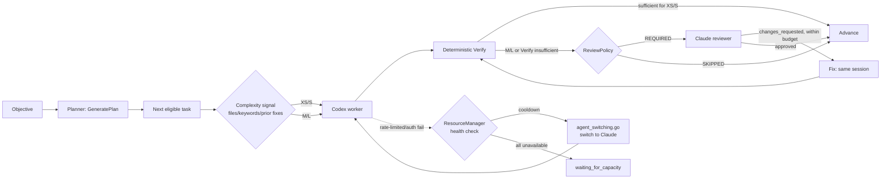

# Agent Resource Efficiency Audit

Status: audit only, no implementation
Date: 2026-08-14
Base audited: `f480b6283` on `feat/engineering-control-center` (workflow packages introduced by commits `5f27851ec`..`f480b6283`, i.e. checkpoints 8A–8G)
Method: read of `backend/internal/workflow/**`, `backend/internal/adapters/planner/command/**`, `backend/internal/adapters/agent/codex/**`, `backend/internal/adapters/reviewer/claudecode/**`, `backend/internal/observe/usage/**`, `backend/internal/adapters/chatdriver/codexappserver/**`, `backend/internal/session_manager/agent_switching.go`, `backend/internal/httpd/**`, `backend/internal/daemon/workflow_wiring.go`, `frontend/src/renderer/lib/platform-adapter.ts`, migrations `0094`–`0101`, and matching tests. All claims below are anchored to file:line evidence gathered in this pass; nothing is inferred from `docs/architecture.md` or `docs/backend-code-structure.md`, both of which **predate the `workflow` package entirely** and describe none of 8A–8G (confirmed: neither doc's package tree lists `internal/workflow`).

---

## A. Executive summary

The engine works end-to-end and is already reasonably frugal in the places that matter most: it does not re-plan on every read, it does not re-send full transcripts on fix cycles, and Verify is genuinely LLM-free with real sandboxing. The waste that exists today is concentrated in exactly the shape the audit brief predicted — **N Master Planner tasks spawn N independent Codex sessions that each rediscover the repository from zero**, and **every completed work step gets a full Claude reviewer pass with no triviality gate**, regardless of whether the change was a two-line rename or a security-sensitive migration. Neither of these is a bug; both are simply unbuilt policy layers on top of a sound mechanism.

The bigger near-term risk is not context waste but **operational fragility for unattended/24-7 use**: there is no attempt-count ceiling on work/review dispatch (only the fix-cycle counter is budgeted), no classification of *why* a step failed (rate-limited vs. auth vs. transient vs. genuine failure), and the durable Claude↔Codex agent-switching saga that already exists in `session_manager` is **completely disconnected** from the workflow engine — a rate-limited Codex worker today has no failover path at all inside 8A–8F. That is the P0.

## B. Real architecture today

```mermaid
flowchart TB
    subgraph Planner["Master Planner (8F)"]
        MC[master_coordinator.go\nGeneratePlan]
        CTX[PlannerContextBuilder\ncommand/context.go]
        LLM[command.Planner.Generate\nclaude --print --model sonnet]
    end
    subgraph Engine["Workflow engine (8A)"]
        REC[reconcileMasterTasks\nsequential DAG walk]
        CH[Child WorkflowRun\nplan/work/review/fix/verify/advance]
    end
    subgraph Roles
        W[Codex worker session\nSpawner.Spawn]
        RV[Claude reviewer pane\nReviewerLauncher.Launch]
        VF[Deterministic Verify\nno LLM]
    end
    Obj[Objective] --> MC
    MC --> CTX --> LLM --> MC
    MC -->|workflow_tasks + dependencies| REC
    REC -->|one task at a time| CH
    CH --> W
    W -->|fingerprint after| RV
    RV -->|changes_requested| FIX[Fix: same session, Send()]
    FIX --> RV
    RV -->|approved| VF
    VF -->|pass| REC
```

Everything downstream of `GeneratePlan` is driven by **read-time reconciliation**, not a scheduler: `reconcileMasterTasks` and the single-run `advanceReviewFixCycle`/`maybeVerify` cascade only run inside `GetRun` (API poll) and `Reconcile` (boot) — confirmed by the doc comment in `backend/internal/daemon/workflow_wiring.go:20-25` ("progress is derived at read time (GetRun) and at boot (Reconcile), never polled by a scheduler") and by the absence of any `go func()`/worker pool in `master_coordinator.go`. The frontend polls workflow detail every 2 seconds (`docs/deployment/headless.md:54-55`), which is what actually drives progression in practice.

## C. Full flow, frontier by frontier

1. **Objective → Planner context** (`master_coordinator.go:77` → `command/context.go:20-47`): builds git branch/HEAD/dirty status plus a **fixed whitelist of 6 files** (`AGENTS.md, README.md, go.mod, package.json, docs/architecture.md, docs/STATUS.md`), each truncated to 48 KiB and SHA-256'd. Rebuilt from scratch on **every** `GeneratePlan` call; the content is stripped before persistence (`manifest.Documents[i].Content = ""`, `master_coordinator.go:82-83`) so nothing durable can be reused across calls — this is a storage-size optimization, not a context-reuse one.
2. **Planner LLM call** (`command/planner.go:28-79`): shells out to `claude --print --output-format json --json-schema ... --tools "" --permission-mode plan --no-session-persistence --model sonnet`, 3-minute timeout. Always invoked — no cheap/deterministic path for small objectives.
3. **Structured plan → workflow_tasks + workflow_task_dependencies**: validated (`NormalizeAndValidatePlan`, `master_plan.go:79-173`; cycle-checked, ≤12 steps), hashed, persisted.
4. **DAG walk → one child WorkflowRun per task** (`master_coordinator.go:287-377`): strictly sequential — `if active { return nil }` (line 352-354) blocks picking a second task while one is running, even if siblings are dependency-eligible.
5. **Child run → Codex work step** (`dispatch.go:138-152`): fresh `Spawner.Spawn`, fresh worktree, prompt = objective + acceptance criteria + fixed guardrail text (`plan.go:91-118`). **No AGENTS.md, no discovered-file list, no PlannerContext is threaded through** — the child never sees what the Planner already read in step 1.
6. **Work → Review** (`cascade.go:164-331`): fires unconditionally as soon as the work step completes; prompt built by `BuildReviewPrompt` (objective, acceptance criteria, branch/worktree path, fingerprint-as-SHA) — reviewer inspects the live worktree itself rather than receiving a diff blob.
7. **Review changes_requested → Fix** (`fix_dispatch.go`, `cascade.go:140-181`): reuses the **same live Codex session** via `MessageSender.Send` — no new spawn, no worktree rebuild. Budget: `MaxFixCycles = 3` (`domain/workflow_policy.go:20`), enforced at `review_progress.go:94-97` and re-checked defensively at `cascade.go:162-167`.
8. **Approved → Verify** (`verify.go:147-323`): pure `exec.CommandContext`/file-hash checks, denylisted dangerous commands, worktree-sandboxed paths, fingerprint-gated against TOCTOU (worktree must still match what was reviewed).
9. **Verify pass → next task** (`master_coordinator.go:335-338`, `346-351`): parent task marked complete; next eligible task picked on the **next** read/reconcile pass.

## D. Context map by role

| Role | Gets | Rediscovers | Persists after |
|---|---|---|---|
| Planner | git branch/HEAD/dirty + 6 whitelisted docs (≤48KB each) | full repo tree beyond the 6 files (LLM does its own exploration if `--tools` allowed any — but `--tools ""` is passed, so **no tools at all**: pure text-in/JSON-out) | plan hash + doc hashes only (content dropped) |
| Codex worker (per task) | objective + acceptance criteria + guardrail text only | AGENTS.md, README, architecture docs, symbol locations — everything the Planner already read | fingerprint (hash of worktree state), not content |
| Claude reviewer | objective + acceptance criteria + branch/worktree path + fingerprint-as-SHA (inspects live worktree via allowed `git diff/status/log`) | nothing from the Planner or prior review cycles beyond `reviewRun.Body` fed forward only into the *next fix prompt*, not into the reviewer's own prompt | review verdict + findings body |
| Fix (same session) | prior findings (`reviewRun.Body`) + objective/acceptance criteria (re-read from persisted plan artifact) | nothing — same live process | new fingerprint |
| Verify | file/command specs from the plan artifact | nothing (deterministic) | pass/fail + tail-bounded (16KB) output |

## E. Provider/model map (as coded, not as configured)

| Role | Provider/model | Where hardcoded | Override |
|---|---|---|---|
| Planner | Claude, model `"sonnet"`, provider string `"anthropic"` | `command/planner.go:23,49` (`Descriptor()` and `Generate()` literals); `daemon/workflow_wiring.go:29-33` defaults | `AO_PLANNER_BIN` / `AO_PLANNER_MODEL` env vars |
| Worker | Codex, harness literal `"codex"` | `workflow/dispatch.go:52,141,281`, `fix_dispatch.go:146` | **none found** — no flag/config path changes the work-step harness |
| Reviewer | Configurable — `domain.ReviewerHarness` is a real 27-value enum (`reviewerharness.go:8-38`) selected per run/session, not hardcoded in workflow code | n/a | already provider-neutral at this layer |

Existing seams: `workflow.Planner`/`workflow.PlannerDescriptor` interfaces (`master_plan.go:69-74`) already decouple the coordinator from a concrete planner — only one implementation is wired in. `ports.AgentModelCatalog` (`adapters/agent/modelcatalog/catalog.go`) is a real per-agent model picker (codex: gpt-5.6-sol/terra/luna, gpt-5.5, gpt-5.4/-mini, gpt-5.3-codex; claude-code: sonnet/opus/haiku) but it is **UI-facing for interactive sessions only** — the workflow worker dispatch path never consults it.

## F. Usage/telemetry that actually exists today

- **Token usage** (`model_usage_events` table, migration `0052`): input/uncached-input/cache-read/cache-write/output/reasoning tokens, keyed to `usage_bindings`/`usage_sources` (kind: `claude_main`, `claude_subagent`, `codex_rollout`). Ingested from native JSONL transcripts via a byte-offset cursor (`observe/usage/ingestor.go`). Claude reports per-message deltas directly; Codex reports cumulative totals that the parser diffs against a rolling baseline (`parser.go:538-549`), with non-monotonic-regression anomaly detection.
- **No context-window, duration, or per-role (planner/worker/reviewer) column exists on `model_usage_events`.** Every Claude/Codex CLI invocation — worker, reviewer, planner, interactive chat — writes the same native JSONL shape and is ingested identically; the only differentiation is the `harness`/`kind` string on the binding, not a workflow-role field.
- **Codex rate limits** are a *separate*, live, non-usage-table system: `ports.ChatRateLimits` (primary/secondary used-percent + resets-in-seconds + plan label) fetched via `account/rateLimits/read` and pushed via `account/rateLimits/updated` notifications, stored as **current conversation state** (`domain.ConversationRateLimits`) on the Chat conversation row — not historized, not joined to workflow runs.
- **Claude rate limits**: no equivalent typed snapshot was found for the Claude Code CLI path (ACP driver) in this pass — only Codex's app-server protocol exposes structured rate-limit reads.
- **Nothing in the telemetry system is currently joined to `workflow_runs`/`workflow_attempts`.** A workflow attempt today cannot be correlated to "how many tokens did this task cost" or "was this attempt rate-limited" from stored data alone.

## G. Principal consumption multipliers

| Multiplier | Severity | Evidence |
|---|---|---|
| N planned tasks → N independent Codex repo rediscoveries | **ALTO** | `dispatch.go:138-152`, fresh `Spawn` per task, worker prompt carries no AGENTS.md/discovered-file content (§D) |
| Unconditional Claude review on every work step | **ALTO** | no triviality/size/diff gate anywhere in `workflow/*.go` (grepped for `trivial|skip.*review`, none found besides a doc-comment string) |
| Planner LLM call on every objective, no cheap path | **MEDIO** | `GeneratePlan` always calls `c.planner.Generate`; no size/keyword short-circuit found |
| Fix-cycle re-send of findings + full acceptance criteria each cycle | **BAJO** | reused session avoids re-scan; only the prompt text (findings + criteria) is rebuilt, which is small and necessary |
| Verify command scope | **MEDIO** (compute, not context) | fixture evidence (`master_plan_test.go:17-18`) shows even small per-step plans emit repo-wide `go test ./...` rather than package-scoped gates — no code path narrows scope |
| Sequential-only DAG execution | **BAJO today, ceiling later** | deliberate per the audit brief; not wasteful at the target 4vCPU/8GB scale, but means wall-clock (not capacity) is the constraint for now |

## H. Current risks

- **Context explosion**: bounded today — no unbounded transcript accumulation was found; fix cycles reuse a live session rather than growing a stored context blob. Risk is latent (a long Codex session across 3 fix cycles could grow its own native context), not structural in AO's own data model.
- **Agent explosion**: structurally prevented — the sequential `active` guard (`master_coordinator.go:352-354`) and the total absence of `go func()` in the coordinator mean AO cannot spawn more than one worker/reviewer pair at a time today. No `maxConcurrentTasks`/`maxAgents`/`maxDepth` constants exist because none are needed yet.
- **Retry explosion**: **partially unguarded**. `MaxFixCycles=3` bounds the review↔fix loop, but there is **no attempt-count ceiling on work-step dispatch or review-step dispatch themselves** — dispatch is idempotency-key-guarded (won't double-spawn), but nothing was found that stops an endlessly-erroring work step from being re-attempted indefinitely across daemon restarts if `Reconcile` keeps re-entering `dispatchWorkStep`. This needs verification against `recovery.go:92-114`'s idempotency guard before treating it as fully safe.
- **Review explosion**: not possible beyond `MaxFixCycles`, but review is *spent* unconditionally per task regardless of task triviality — this is a policy gap, not a runaway-loop risk.
- **Subscription exhaustion**: real and currently **unmitigated** for workflow execution. There is no rate-limit-aware gating between the Codex telemetry described in §F and the workflow dispatch path in §C. A rate-limited Codex account today produces an ordinary work-step failure with no distinguishing error class beyond whatever the process/session layer surfaces.
- **Duplicate discovery**: confirmed structurally (§D) — Planner's context and each worker's own discovery are two disjoint reads of the same repository, once per plan and once per task.

## I. What already exists and should be reused, not rebuilt

- `command.ContextBuilder` (`adapters/planner/command/context.go`) — the only context-assembly abstraction in the codebase; already role-agnostic in structure (branch/HEAD/dirty + hashed docs) even though today it's called from exactly one place.
- `domain.ReviewerHarness` — a genuine multi-provider registry (27 harnesses) already used for reviewer selection; the pattern a future `ModelRouter` should imitate rather than reinvent.
- `workflow.Planner` / `workflow.PlannerDescriptor` interfaces — the seam a router would slot behind for the planner role; already decoupled from the coordinator.
- `WorkspaceFingerprint` (`fingerprint.go`) — a real, deterministic, content-hashing "what changed" signal already computed on every work/fix step. This *is* most of what a lightweight `TaskKnowledge.changed_files` fact would need; no new mechanism required to know what files a step touched.
- `workflow_checkpoints` (append-only, one row per transition) — already the durable record of branch/worktree/base-sha/head-sha/review-verdict/fingerprint per step. A `TaskCheckpoint` per §26 of the brief substantially already exists under a different name.
- `session_manager/agent_switching.go` — a complete, tested, generation-fenced Claude↔Codex failover saga with idempotency and continuation-message building. This is 100% of the *mechanism* a Subscription-first/failover policy (§16-19) would need; it is simply not called from `workflow/*.go` today.
- `ports.ChatRateLimits` / `domain.ConversationRateLimits` — the live Codex health signal a `ResourceManager` would consume; exists only for Chat-mode conversations today, not for TUI-mode workflow worker sessions (worth checking whether workflow's Codex sessions run in a mode that populates this at all — not verified in this pass).
- `ValidateVerifyCommand` denylist — the existing "deterministic tools first" guardrail; extending Verify's command surface should extend this list, not bypass it.

## J. Real gaps

- No context reuse between Planner's read of AGENTS.md/README/architecture docs and each worker's independent discovery of the same files.
- No complexity classification anywhere — every task, trivial or not, gets the full plan→work→review→fix→verify→advance chain.
- No review policy — REQUIRED/OPTIONAL/SKIPPED does not exist as a concept.
- No model/provider router — worker harness is a hardcoded string literal, not a decision.
- No resource/health manager and no rate-limit-aware dispatch gating.
- No error classification (`rate_limited`/`auth`/`transient`/`tool`/`test_failed`/`review_changes_requested`) distinct from the existing `workflow_attempts.error_class` enum's fixed set — need to check whether that enum (widened across migrations 0096/0097/0099/0100) already covers this before building a parallel one.
- No attempt-count budget for work/review dispatch (only fix-cycle count is budgeted).
- No cross-role telemetry join — tokens/rate-limits cannot be attributed to a `workflow_run`/`workflow_attempt` from stored data today.
- No session-refresh/compaction policy for Codex/Claude sessions reused across fix cycles (see §Session Refresh Policy below).

## K. Planner evaluation (8F)

Sound validation (cycle detection, hash, step-count ceiling) and a genuinely deterministic acceptance path. The two real inefficiencies: (1) every objective pays the LLM call — even a one-line objective — because there is no cheap/heuristic path; (2) the context sent is always rebuilt from disk, never diffed against a prior call's hash even when nothing in the whitelist changed, though content is intentionally not persisted so there's currently nothing to diff *against*. The fixture evidence (`master_plan_test.go`) shows the planner's own test plans are small (2 steps) with per-step `go test ./...` gates — consistent with "prefer 2-4 substantial steps" prompt guidance, i.e. no evidence of task over-generation in practice, only evidence of unscoped verify commands.

## L. Codex worker evaluation

Clean separation of spawn (once per task) vs. continuation (same session across fix cycles) — this is the efficient half of the design. The inefficiency is entirely on the *input* side: zero repo-context transfer from Planner or from sibling tasks, so N tasks really do mean N cold starts against the same repository. Note also (§4 of research, security angle): the worker adapter explicitly does **not** rely on Codex's own sandbox flags for containment ("Read-only confinement remains the worker sandbox's job; no supported CLI flag alone provides filesystem containment", `command.go:159-161`) — worktree isolation is the only real containment, and the "don't push/merge/touch other branches" guardrails are soft, LLM-obeyed prompt text, not tool-enforced. That's an acceptable risk for a single-worktree-per-task model but is worth naming explicitly for 24/7 operation.

## M. Claude reviewer evaluation

Correctly hard-sandboxed (tool allowlist + explicit denylist + `PermissionModeAuto`, not `bypassPermissions`) and correctly fingerprint-gated against reviewing stale state. The inefficiency is policy-shaped, not mechanism-shaped: it fires on every task unconditionally. A text-only or exact-file-creation task pays the same reviewer cost as a security-sensitive one. This is the single highest-leverage place to introduce a `ReviewPolicy` without touching the reviewer mechanism at all.

## N. Fix loop evaluation

Well-built: same session, same worktree, same branch, budget-enforced twice (once at observation time, once defensively at dispatch time), idempotency-keyed per cycle so a crash/restart can't double-send findings. Nothing to change here architecturally; this is closest to the "good" reference for how other roles should reuse context.

## O. Verify evaluation

Meets the brief's requirement exactly: no LLM, real denylist (shell interpreters, `rm`, deploy tools, destructive git subcommands), worktree-sandboxed paths with symlink-escape checks, TOCTOU-guarded via fingerprint comparison before *and* after execution, timeout-capped, retry-safety-gated on crash recovery. The one real gap is scope: nothing narrows a step's build/test/vet commands to the touched package, so small steps and large steps currently pay the same `go build ./...`/`go test ./...` cost — this is a deterministic-tools-first opportunity (§23/§28 of the brief), not a Verify architecture problem.

## P. ContextBuilder — recommended only if justified

`command.ContextBuilder` already has the right shape (role-agnostic-capable, hash-producing, size-capped). Evolving it toward `buildContext(task, role, attempt)` is justified *if and only if* the Review Policy (§S) and worker-context-sharing gap (§J) get addressed, because both would otherwise duplicate the whitelist-doc-reading logic that already exists here. Do not build a second builder.

## Q. Shared TaskKnowledge — recommended only if justified

Given `WorkspaceFingerprint` and `workflow_checkpoints` already capture "what changed" durably, a `TaskKnowledge` table is only worth adding for facts that are genuinely *not* derivable from checkpoints today: relevant symbols, architecture constraints, decisions, risk areas discovered by the Planner or a prior task. The changed-files/dependencies half of the brief's wishlist is already covered by existing tables; only the free-text facts half is a real gap.

## R. ComplexityClassifier — recommended only if justified

Real signals already computable from existing data without new instrumentation: files affected (via fingerprint diff), presence of migration/auth-path keywords in objective/acceptance-criteria text, diff size (fingerprint content-hash count), attempt history (`workflow_attempts`), whether Verify's own checks already fully demonstrate the acceptance criteria. No ML needed, consistent with the brief.

## S. ReviewPolicy — recommended, highest-leverage single change

This is the one place where a small, deterministic policy layer would measurably cut Claude spend without touching the reviewer mechanism. Candidate REQUIRED triggers, all computable from data already in `workflow_tasks`/fingerprints: auth/security/migration/concurrency keywords in objective or acceptance criteria, large fingerprint diff, prior fix cycle on this task (never skip review after any correction), any task the Planner itself flagged high-risk if that field exists in the plan schema (not verified — worth checking `PlannedStep` for a risk field before assuming it needs to be added).

## T. ModelRouter — recommended, scoped

Only the worker role is truly hardcoded (`"codex"` string literal in 4 call sites). The planner role already has an interface seam; the reviewer role already has a real registry. A router's actual job is narrower than the brief's ambition: give the worker role the same seam the planner already has, and give both roles a place to consult `ports.AgentModelCatalog`-style availability data instead of a compile-time default.

## U. ResourceManager — recommended, P0-adjacent

Must distinguish `SOURCE=SUBSCRIPTION` (Codex CLI/ChatGPT, Claude Code/Claude subscription) from `SOURCE=METERED` per the brief. `ports.ChatRateLimits`/`domain.ConversationRateLimits` is the existing subscription-side signal for Codex today — worth confirming whether the workflow engine's Codex worker sessions run in a mode (TUI vs Chat) that actually populates this table before assuming it's readily available; the research pass found this wired for Chat-mode conversations specifically.

## V. Subscription-first routing

Not implementable until §U exists; no premature design here per the brief's own instruction.

## W. Failover/cooldown architecture — this is the P0

The mechanism (`session_manager/agent_switching.go`) is complete and unused by workflow. The gap is entirely a wiring/policy problem, not a missing primitive: `workflow/*.go` has zero references to `SwitchAgent`/`AgentSwitch` (grepped, confirmed absent). Concretely: `dispatch.go`'s `Spawner.Spawn` call hardcodes `Harness: domain.AgentHarness("codex")` with no fallback branch, and `fix_dispatch.go`'s `MessageSender.Send` targets `reviewRun.SessionID` with no health check first. See the recommended checkpoint below.

## X. Concurrency / fan-out policy

Current: hard-sequential by construction (`active` guard), zero goroutines in the coordinator. For the stated 4vCPU/8GB/160GB target, this is appropriate as-is. Future parallelism, when justified, should gate on: independent worktrees (already true — one per session), non-overlapping file paths between sibling tasks (would need a real signal — fingerprint diff of *planned* touch points, which doesn't exist pre-execution), and provider capacity from §U. Not needed now.

## Y. Retry/escalation policy

`MaxFixCycles=3` is the only real budget today. A `workflow_attempts.error_class` enum already exists and was widened across migrations 0096/0097/0099/0100 (including `fix_budget_exhausted` in 0099) — check its current full value set before adding a parallel classification scheme; it may already be closer to the brief's `rate_limited/auth/transient/tool/test_failed/review_changes_requested` wishlist than assumed.

## Z. Deterministic-tools-first strategy

Verify is already this. The concrete opportunity is narrowing Verify command scope per task (package-level build/test instead of repo-wide) rather than adding new deterministic tooling — the infrastructure exists, only the Planner's generated commands are unscoped.

## AA. Repo/Symbol index

No evidence needed to add one yet — the Planner's whitelist-doc approach and Verify's fingerprint-diff approach cover the only two "where is X" needs found in this pass (architecture-doc lookup, changed-file detection). Revisit only if `TaskKnowledge` (§Q) shows workers repeatedly re-deriving the same symbol locations, which would require production telemetry not currently collected (§AJ).

## AB. Context cache / compaction — see Session Refresh Policy below

## AC. Useful-work telemetry

`TaskOutcome`-shaped data is partially derivable today from `workflow_runs`/`workflow_attempts`/`workflow_checkpoints` (state, error_class, review verdict) but nothing currently joins it to `model_usage_events` or `ConversationRateLimits`. Before any cost/efficiency metric is trustworthy, that join needs to exist (§AJ).

## AD. Security implications for 24/7 operation

- Worker containment is worktree-only; no OS sandbox flag is used (`command.go:159-161`). Acceptable for a trusted single-operator host, worth re-examining before any multi-tenant or less-trusted-objective use.
- Reviewer containment is strong (tool allowlist + denylist, non-bypass permission mode).
- Verify containment is strong (denylist, no shell, worktree-sandboxed, symlink-escape-checked).
- The LAN/mobile listener's auth cookie is deliberately non-`Secure` by documented design (ADR 0001, home-network-only) — this is an accepted risk for a home LAN, not for an unattended internet-facing Hetzner box; `docs/deployment/headless.md` already states remote/TLS/auth are explicitly out of scope for 8G and belong to a later checkpoint. Nothing here needs to change now, but it means **8G in its current form must not be exposed beyond loopback on the target server** without that later checkpoint.

## AE. Headless/Hetzner implications

`ao server` is hard-loopback by construction (`server.go:53-55` validates `--host` must equal the loopback constant, erroring otherwise) — this is a real guardrail, not just convention, so accidental remote exposure via a bad flag is already prevented at the CLI layer. Static web assets and API share one origin/port, so the daemon-down-while-Mac-asleep scenario the brief asks about doesn't apply once this runs as the primary process on an always-on Linux host — it applies today only to the *desktop* Electron-supervised mode. ResourceManager/telemetry data (§F, §U) has no host-affinity concerns since it's plain SQLite rows; the open question is Codex/Claude CLI auth persistence for the service account across host reboots, which is outside this pass's evidence.

## AF. P0/P1/P2 roadmap

**P0**
1. Wire the existing `agent_switching.go` saga into workflow dispatch as a failover path when a work-step or fix-step dispatch fails with a rate-limit/auth signal. The mechanism exists; only the call site is missing. This directly serves the user's stated next-checkpoint intent and is the single highest-value change identified.
2. Add an attempt-count ceiling on work-step and review-step dispatch (today only fix-cycles are budgeted) — needed before unattended overnight operation, otherwise a systematically-failing step could re-dispatch across every `Reconcile`/`GetRun` call indefinitely. Verify this isn't already implicitly bounded by the idempotency-key/outbox mechanism before building a new counter.

**P1**
3. `ReviewPolicy` (§S) — deterministic REQUIRED/SKIPPABLE rules using data already in `workflow_tasks`/fingerprints. Highest context-efficiency return for the lowest implementation risk, since it touches zero reviewer mechanism.
4. Thread Planner's already-fetched whitelist docs (or a diff/reference to them) into the first work-step prompt of each child task, avoiding the N-cold-starts pattern for the cheapest-to-fix piece of it (the 6 whitelisted docs, not full repo discovery).
5. Scope Verify commands per task (package-level vs repo-wide) — infrastructure exists, only the Planner's generated `VerificationCommandCheck` needs narrower targets.
6. Join `model_usage_events`/`ConversationRateLimits` to `workflow_attempts` so §AC/§U become measurable instead of assumed.

**P2**
7. `ModelRouter` for the worker role (planner/reviewer already have seams).
8. `ComplexityClassifier` — needs the telemetry from P1.6 to validate thresholds against real data, not invented ones.
9. `TaskKnowledge` free-text facts table — only the free-text half; changed-files/dependencies are already covered by fingerprints/checkpoints.
10. Repo/symbol index — no evidence of need yet; revisit after P1.6 telemetry exists.

## AG. Files affected per recommendation (future work, not this change)

| Recommendation | Primary files |
|---|---|
| P0.1 Failover wiring | `backend/internal/workflow/dispatch.go`, `fix_dispatch.go`, `backend/internal/daemon/workflow_wiring.go`, `backend/internal/session_manager/agent_switching.go` (consumer only, not modified) |
| P0.2 Attempt ceiling | `backend/internal/workflow/dispatch.go`, `review_dispatch.go`, `backend/internal/domain/workflow_policy.go` |
| P1.3 ReviewPolicy | `backend/internal/workflow/cascade.go`, `master_coordinator.go`, new `backend/internal/workflow/review_policy.go` |
| P1.4 Context threading | `backend/internal/workflow/plan.go` (`BuildWorkStepPrompt`), `master_coordinator.go:379-411` (`dispatchMasterTask`) |
| P1.5 Verify scoping | `backend/internal/adapters/planner/command/planner.go` (prompt), `backend/internal/workflow/master_plan.go` (schema) |
| P1.6 Telemetry join | `backend/internal/storage/sqlite/migrations/`, `backend/internal/observe/usage/*`, `backend/internal/workflow/workflow.go` |

## AH. New components strictly necessary right now

None. Every P0 item is wiring existing mechanisms together, not new architecture.

## AI. What NOT to implement yet

ModelRouter beyond the worker seam, ComplexityClassifier, TaskKnowledge, Repo/Symbol index, parallel fan-out, metered-API fallback, multi-account evasion (explicitly out of scope per the brief), auto-merge, any deployment/TLS work for 8G.

## AJ. Telemetry missing before choosing models by cost/efficiency

A `workflow_attempt_id` (or equivalent) foreign key/join path from `model_usage_events` and from `ConversationRateLimits` snapshots — without it, every "model A vs model B" or "cost per completed task" question in §29-30 of the brief is currently unanswerable from stored data, only from live log inspection.

## AL. Session Refresh Policy — native conversation reuse vs. compaction

Scoped answer to the follow-up question: when do Codex/Claude reuse a native conversation during workflow execution, and when would compaction + a fresh session be warranted.

**What reuse actually happens today, confirmed by evidence:**
- Within one work step's fix cycles, the **same live session/pane is reused** across all `MaxFixCycles=3` attempts via `MessageSender.Send` (`fix_dispatch.go:125`, `session_manager/manager.go:2480-2520`) — this types into the still-running process, it is not a native-provider "resume" call. No new conversation ID is minted between cycle 1 and cycle 3 of the same task.
- If the pane has *exited* between cycles (not the common path), the Codex adapter has a cold-restore mechanism — `codex resume <agentSessionId>` (`codex.go:144-147`) — that reattaches to the provider's own conversation ID (`ContinuationCapabilities()`/`NativeConversationID`, `codex.go:193-286`).
- Across **different tasks** in the same master plan, there is no session reuse at all — each task gets a brand-new `Spawner.Spawn` (§C step 5), so "session refresh" in the cross-task sense already happens unconditionally, just not by policy — it's a side effect of the one-task-one-session design.
- The Claude↔Codex `agent_switching.go` saga (§W) does have a real compaction concept for its own purpose: `buildTargetContinuationMessageWithLimit` (`agent_switching.go:1537-1645`) builds a bounded snapshot + transcript tail plus a `continuationCompactionNotice`, when *switching harness*. This is not currently invoked for same-harness session refresh, only for a cross-harness handoff.

**What telemetry would be needed before setting any threshold, and what exists:**
- Accumulated-context size per live session/conversation: **not found**. `model_usage_events` records token deltas per ingested transcript event (§F) but nothing in the workflow package reads cumulative token totals per session before deciding to continue a fix cycle — `dispatchFixStep`/`maybeDispatchFix` make their continue/stop decision purely on `cycleCount` vs `MaxFixCycles`, never on token/context size (confirmed: no reference to `model_usage_events`, `ModelUsageEvent`, or `ConversationRateLimits` anywhere in `backend/internal/workflow/*.go`).
- Codex's own `model_context_window` field is parsed from `token_count` events (`observe/usage/parser.go:522-527`) but explicitly **not persisted per event** — it's used only to detect a context-fill baseline reset for the usage-anomaly detector, not exposed anywhere the workflow engine could consult it.
- Claude Code has no equivalent context-window/remaining-budget signal surfaced in this codebase in this pass.
- Attempt/cycle count is available (`workflow_attempts`, `cycleCount` in `review_progress.go`/`cascade.go`) — this is the one input a refresh policy could use *today* without new instrumentation.
- Planned-task change (new task = new session already, see above) is available for free.
- "Size of relevant material" (diff size, files touched) is available via `WorkspaceFingerprint`'s per-path content-hash list (§Q) — a large fingerprint diff between fix cycles is a computable proxy for "this cycle's context is getting big," without needing raw token counts.

**Conclusion, honoring the "no arbitrary thresholds" instruction:** a Session Refresh Policy cannot be responsibly threshold-tuned yet because the one number that would matter most — accumulated context/tokens on the *live* session across fix cycles — is not captured anywhere in AO's own data model today (only ingested-transcript deltas after the fact, and Codex's context-window field is explicitly discarded). The two signals that *are* available without new work (fix-cycle count already capped at 3, and fingerprint-diff size as a proxy for material size) are weak proxies, not real context measurements, and using them to trigger "compact and start a new session" would itself risk losing exactly the live-process continuation that makes fix cycles cheap today (§N). Before any refresh policy ships, the missing piece is: surface per-session live token/context usage (Codex already computes `model_context_window` internally and discards it — persisting it, not re-deriving it, is the small addition) and join it to `workflow_attempts` (the same gap as §AJ). Recommendation: treat this as a data-collection prerequisite folded into P1.6, not a standalone policy to design now.

## AK. Mermaid — minimal target flow (conceptual, not a commitment)



---

## Recommended next checkpoint

**Codex↔Claude failover wiring for workflow work/fix dispatch, plus an attempt-count ceiling.**

This is deliberately narrower than "ResourceManager + Agent Health + Quota Detection + Subscription-first routing + Cooldown + Failover" as one mega-phase. Verification against the actual code changed the shape of the recommendation: the mechanism (durable, generation-fenced, idempotent Claude↔Codex switching) already exists and is fully built in `session_manager/agent_switching.go` — it needs a caller, a minimal failure classifier at the dispatch call sites, and a policy snapshot field, not a new subsystem. A full ResourceManager with typed subscription/metered accounting, historized rate-limit tracking, and a general router is P1/P2 work that should follow *after* this smaller checkpoint proves the wiring pattern on the one path that matters most for unattended operation: a Codex worker hitting a rate limit mid-task.

Why this over the review-policy P1 item: the review-policy change saves capacity but doesn't prevent operational failure; the failover gap means today, unattended, a rate-limited Codex account simply produces a stuck/failed workflow with no recovery path — that's a correctness and availability problem, not just an efficiency one, so it dominates.

Suggested minimal scope for that checkpoint (not a plan, just a boundary):
- A typed failure classification at the two call sites that currently hardcode `Harness: domain.AgentHarness("codex")` and `MessageSender.Send` — reusing whatever signal `ports.ChatRateLimits`/session start failures already expose, not inventing new ones.
- One fallback order (`codex → claude-code`), guarded by the same "never during approval/blocked/destructive-git/ambiguous-target" rules the agent-switching saga's own documentation already states it enforces.
- A `cooldown_until`-shaped field somewhere reachable from workflow dispatch (new column vs. reuse of an existing one — needs a follow-up read of `agent_switches`/`ConversationRateLimits` schemas before deciding, not assumed here).
- Explicit non-goal: no metered-API fallback, no multi-account, no new UI beyond exposing the resulting state.
