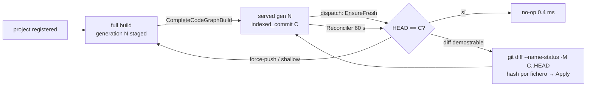
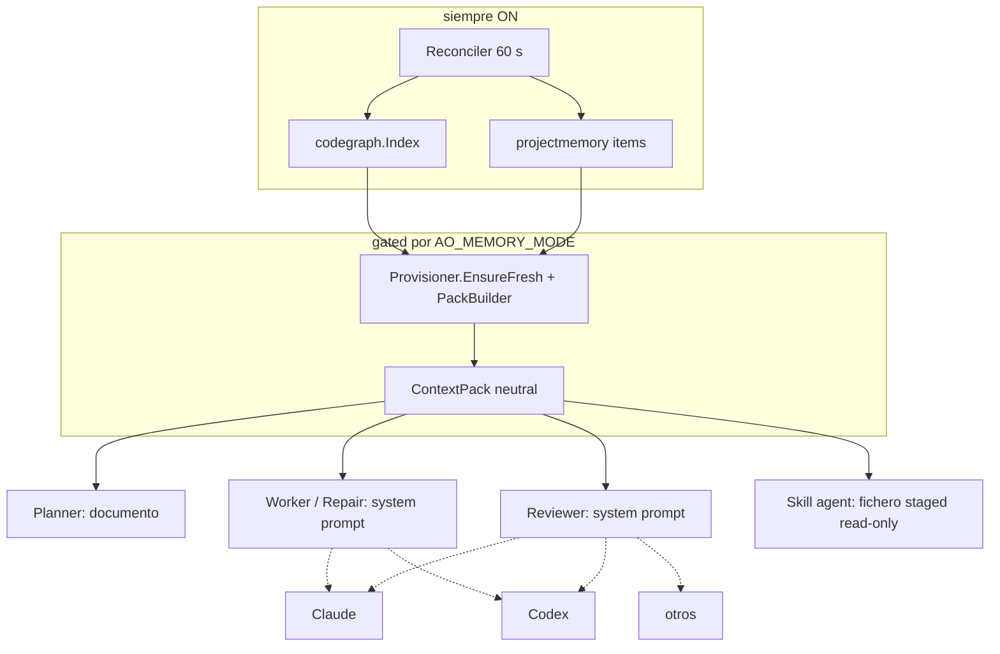

# Frente 3 / 3A — Propuesta de arquitectura de Project Memory

Fecha: 2026-09-24 · Estado: **propuesta**. No hay nada implementado en esta
fase. Se basa en el inventario de [01](01-discovery-report.md) y en el mapa de
[02](02-context-flow-map.md).

**Tesis.** AO ya tiene la arquitectura objetivo casi entera. La propuesta
consiste en **completar y corregir** lo que existe, no en añadir una capa
nueva. Donde este documento dice "existe", se refiere al código de
`3030d85f2`.

---

## 1. Build vs Integrate vs Hybrid (ETAPA 5)

| Criterio | A. Graphify como núcleo | B. Infraestructura AO existente | C. Híbrido (B + adaptador externo read-only) | D. Grafo propio mínimo nuevo |
|---|---|---|---|---|
| Complejidad | alta: bridge Python, esquema ajeno, sincronización | **baja**: corregir y cablear | media: B + contrato con el adaptador | alta y **redundante**: B ya es esto |
| Dependencia externa | Python + ~30 gramáticas nativas | ninguna | opcional, aislada | ninguna |
| Mantenimiento | seguir releases casi diarias | propio | propio + contrato fijado | propio, duplicado |
| Precisión | tree-sitter bueno; en Go ≤ `go/parser` | Go AST; TS/Py lexer; SQL | la mejor de ambos por lenguaje | ≤ B |
| Incrementalidad | `update` con caché por fichero, sin generaciones | generaciones, CAS y diff demostrable | B manda; el adaptador es un espejo | ≤ B |
| Lenguajes | ~37 | 4 (sin Java) | 4 + los que aporte el adaptador | 4 |
| Velocidad | desconocida en los repos del usuario | medida: no-op 0,4 ms, 1 fichero 1,3 ms, full ~19 s | B + coste del adaptador | ≤ B |
| Almacenamiento | `graph.json` en el repo | SQLite en `~/.ao` | SQLite (el adaptador se importa como filas `derived`) | SQLite |
| Seguridad | proceso externo sobre el repo; log de consultas; LLM opcional | dentro del daemon; tiene gaps conocidos (doc 05) | + superficie del adaptador | = B |
| Observabilidad | propia | integrada (`SyncOutcome`, P3-E, `ao memory graph status`) | parcial para el adaptador | = B |
| Portabilidad | requiere Python | binario único | binario + Python opcional | binario único |
| Ahorro potencial de tokens | igual al del retrieval + entrega | igual (el cuello de botella es la entrega, no el grafo) | igual + cobertura Java | igual |
| Integración con AO | nueva: contratos, CAS y procedencia por hacer | **ya existe** (`Provisioner`, packs, UI) | existe (`TeeGraph`) | nueva |
| Lock-in | alto (formato y herramienta) | ninguno | bajo (detrás de un puerto) | ninguno |

**Recomendación: B ahora, con C como opción futura condicionada a evidencia.**

**Por qué B.** Los cuellos de botella reales que ha encontrado el discovery
no están en el grafo. Son estos:
- la entrega al Worker está rota;
- no se mide el lado del consumo;
- hay defectos de higiene y seguridad;
- falta Java.

Ninguna de las opciones A, C o D resuelve los tres primeros. D equivale a
reconstruir B.

**Por qué C queda como opción.** Java es un hueco real, pero se puede cubrir
de dos formas:
- con un extractor en Go, al estilo de `extract_ts.go` (lexer + llaves), sin
  dependencias y encajando en el modelo;
- con un adaptador read-only.

La elección depende de dos cosas que todavía no sabemos: la precisión
necesaria y cuánto pesan esos proyectos en el uso real de AO. Se trata como
pregunta abierta en el ADR 0012.

---

## 2. Modelo conceptual (ETAPA 6)

Las entidades candidatas se evalúan contra un criterio único: **¿cambia lo
que un rol haría en la siguiente llamada?** Si no, no entran en v1.

| Entidad | Hoy | v1 | Motivo |
|---|---|---|---|
| Project, Repository | `projects`, `repo_id` + `repo_identity` | **sí** (existe) | clave de aislamiento |
| Commit | `indexed_commit`, `source_commit`, `verified_commit` | **sí** (existe) | frescura |
| Branch | `code_graph_index.branch` | sí, sólo informativo | el grafo se indexa por commit, no por rama |
| File | `code_graph_files`, `project_memory_files` | **sí** | ancla de todo |
| Directory / Module / Package | módulos derivados (memoria), census de arquitectura | **sí** (Module) | mapa para el planner |
| Language | census | sí (atributo) | cobertura y selección de extractor |
| Dependency (externa) | items `dependency` desde manifests | **sí** | auditorías y planner |
| Function / Class / Interface | símbolos (`function`, `method`, `type`, `interface`) | **sí** | anclas del retrieval |
| API / Endpoint | símbolo `endpoint` + arista `routes_to` | **sí** | reviewer y security |
| Database / Table / Migration | símbolo `table`, `query`; `reads_from`/`writes_to` | **sí** | DB audit, reviewer |
| Config / SecretReference | símbolo `config` (sólo claves), `configures` | **sí, sólo claves** | nunca valores (doc 05) |
| Test | símbolo `test`, arista `tests` | **sí** | "qué cubre esto" para el reviewer |
| ArchitectureDecision | items `decision` (P2-C) | sí (existe) | procedencia `workflow_knowledge` |
| Skill | catálogo de Skills (no memoria) | **no** | ya vive en `skillcatalog`; no es un hecho del repo |
| Service / Container / Deployment | item `deployment`/`runtime_surface` (P4-H, prosa de ≤9 hechos) | **no como entidad** | sin demanda medida; docker-compose sin redactar es un riesgo (doc 05) |
| Queue / Worker / Environment / ExternalService | parcialmente en `integration`/`runtime_surface` | **no** | ídem |
| Owner (OWNED_BY) | — | **no** | no hay fuente fiable (CODEOWNERS opcional, más adelante) |

| Relación | Hoy | v1 |
|---|---|---|
| CONTAINS | `contains` (memoria), `defines` derivada | sí |
| IMPORTS | `import` | sí |
| CALLS | `call` (nombre sin resolver) | sí, con confianza `inferred` salvo en Go |
| IMPLEMENTS | sólo cuando está probado (Go `var _ I`, TS `implements`) | sí |
| DEPENDS_ON | `depends_on` | sí |
| EXPOSES | `routes_to` | sí |
| READS / WRITES / USES_TABLE | `reads_from` / `writes_to` | sí |
| TESTS | `tests` | sí |
| CONFIGURES | `configures` (claves) | sí |
| USES_QUEUE, DEPLOYS, OWNED_BY | — | **no** |

**Conclusión:** el esquema v1 ya existe. Lo que pide el brief y no está lo
dejamos fuera a propósito, hasta que el benchmark muestre un rol que lo
necesite.

---

## 3. Procedencia y confianza (ETAPA 7)

La base existe: `authority`, `provenance_kind`, `evidence_class` y
`confidence` (migraciones 0146 y 0157), `summary_source` en símbolos, y
`Servable()`. Proponemos **una vista unificada**, no columnas nuevas:

| `source` (vista) | Mapea desde | `confidence` (vista) |
|---|---|---|
| `parser` | símbolos o aristas de `go/parser` | `deterministic` |
| `static-analysis` | extractores lexer (TS/Py), SQL scan, aristas `call` sin resolver | `inferred` si la arista es por nombre; `deterministic` para las declaraciones |
| `manifest` | items `dependency`/`build_test` desde go.mod, package.json… | `deterministic` |
| `git` | commit, diff, paths cambiados | `deterministic` |
| `migration` | símbolo `table` desde migraciones | `deterministic` |
| `docs` | items de README/architecture (`confidenceProse` 0,65) | `inferred` |
| `task-outcome` | `provenance_kind=task_outcome` | `inferred` hasta que se verifica; con `workflow_verified` pasa a `verified` |
| `agent-inference` | **nuevo en el modelo**: todo hecho cuyo contenido redactó un agente (decisions, risks) | `inferred`. Nunca `deterministic` |
| `user` | `evidence_class=user_provided` | `user-confirmed` |
| `external` | un adaptador futuro (Graphify…) | `inferred`, solo lectura |

Reglas:

1. **Todo hecho renderizado en un pack lleva su `source`, `confidence` y
   commit.** Hoy el pack renderiza el resumen y el contenido; hay que añadir
   una etiqueta corta por línea, como `[parser@3030d85]`, dentro del
   presupuesto.
2. **`agent-inference` nunca puede promover su propia autoridad.** Hoy la
   promoción exige prueba de integración (P2-D §5-6), y eso se mantiene. Lo
   nuevo es distinguir "un agente escribió esto" de "el workflow pasó
   verify". Hoy `workflow_verified` significa que verify pasó, no que el texto
   del agente sea correcto (gap G-B6, doc 05).
3. **"¿De dónde sabe AO esto?"** ya tiene endpoint:
   `GET /projects/{id}/memory/provenance/{itemId}` y `ao memory provenance`.
   Hay que extenderlo a símbolos y aristas del grafo, que hoy sólo tienen
   `path` + `body_hash`.

---

## 4. Actualización incremental (ETAPA 8)

Existe y está medida (`docs/code-graph.md`, "What a sync costs"). Resumen y
cambios propuestos:



| Caso | Hoy | Propuesta |
|---|---|---|
| file hash | sí (`body_hash`, digest) | igual |
| commit SHA | sí | igual |
| dirty worktree | se indexa el checkout principal; los worktrees enlazados se rechazan (`sync.go:226`); `TaskChangedPaths` retiene los hechos de ficheros que la tarea reescribió | igual. **No indexar el estado dirty como canónico** |
| deleted / renamed | `-M` + delete + create (la identidad incluye el path) | igual; la memoria ya traslada conocimiento en los renames (P2-D §9) |
| generated | indexados, excluidos del retrieval salvo que se pidan | igual |
| **ignored / untracked** | **se indexan** (no se respeta `.gitignore`) | **indexar sólo `git ls-files`** (más `--others --exclude-standard` como opción explícita). Esto resuelve de raíz la contaminación de `.claude/worktrees` |
| worktrees de agentes | codegraph **no** los salta (gap verificado: MEDUSA 24,7 %) | resuelto por la fila anterior, más la skip list unificada con la de memoria como defensa en profundidad |
| branch switching | cambio de commit → diff o rebuild | igual |
| repos grandes | límites de 20.000 ficheros / 512 MiB (grafo) y 6.000 (memoria); `AO_MEMORY_MAX_*` **ignorados** | aplicar los overrides; al truncar, la cobertura es parcial y se informa, en lugar de servirse como completa |
| trigger | Reconciler 60 s + `EnsureFresh` por dispatch | igual; `workspacewatch` queda como opción futura, no necesaria |

---

## 5. Context retrieval (ETAPA 9)

**Existe:**
- `codegraph.Index.Retrieve`: anclas por paths nombrados, símbolos y términos
  con stemming, ranking por coordinación, expansión acotada a llamadores,
  tests, tablas y rutas, "considered vs selected";
- `PackBuilder`: hechos durables por rol, dedupe y retención de lo stale.

Entrada y salida propuestas, sin cambiar el seam:

```
ContextRequest{ project, repo, commit, role, intent(objective + criteria),
                named_paths, changed_paths, skill_scope?, budget }
  → ContextPack{ header(commit, generation, mode, trust framing),
                 architecture?(planner), graph_evidence, durable_facts,
                 provenance per line, stats(considered/selected/dropped) }
```

Estrategias por rol:

| Rol | Anclas | Expansión | Hoy |
|---|---|---|---|
| Planner | objetivo | arquitectura (≤4 KB) + módulos | existe |
| Worker | objetivo + paths nombrados en la spec | vecindario del símbolo: llamadores, tests, tablas | existe, **no se entrega** (bypass) |
| Reviewer | **diff** (paths cambiados) | símbolos afectados: llamadores, tests que los cubren, endpoints y tablas tocados | parcial; `AnalyzeChanged` sin llamador |
| Fix | hallazgos del reviewer (paths/símbolos citados) | vecindario estrecho | no se entrega (por diseño); a evaluar en el piloto |
| Repair | fallo de verify + hallazgos | vecindario estrecho | usa el pack de worker |
| Skill | scope del manifest ∩ tema de la Skill | ver §8 | no existe |

Mejoras que **sólo** se justifican si el piloto muestra un problema de
precisión:
- FTS5 sobre nombres, paths y resúmenes de símbolos, en lugar del scan por
  substring de 250 ms;
- resolución de aristas `call` a IDs.

Embeddings: **no.** Ni el código ni el diseño los necesitan para v1, y
añadirían un proveedor de embeddings con implicaciones de privacidad.

---

## 6. Presupuesto de contexto (ETAPA 10)

Ya existen presupuestos separados por rol: hechos durables (`budget.go:89-96`)
y grafo (`graphmemory.go:97-104`). No se proponen números nuevos. Lo que sí se
propone:

1. **Prioridad de recorte explícita y uniforme.** Hoy está repartida entre
   `PackBuilder` y `graphmemory`. El orden propuesto, de lo que se elimina
   primero a lo que se elimina último:
   1. hechos `inferred` de baja confianza;
   2. cuerpos (sólo queda el resumen);
   3. vecindario lejano (2.º salto);
   4. arquitectura (salvo en el planner);
   5. anclas directas;
   6. cabecera de procedencia, que nunca se recorta.
2. **Los presupuestos se expresan en tokens estimados** (bytes/4) y **se
   calibran con el ledger**. La calibración es un resultado de 3D, no una
   suposición.
3. **Un presupuesto no es un objetivo.** En `assisted` el pack **suma** bytes,
   así que el presupuesto correcto por rol es el que minimiza el input
   acumulado de la sesión, no el pack más pequeño. Eso sólo se sabe midiendo.
4. Retirar el presupuesto duplicado del `contextrouter`. Hay dos
   ensambladores con presupuesto para los mismos roles (doc 02 §4).

---

## 7. Integración con agentes (ETAPA 12)

**Seam único: `projectmemory.Provisioner` → `ContextPack.Render()`.** Ya es
neutral al proveedor: *"adapters may reformat a pack, never change it"*
(`domain/project_memory.go:38`). El `ProjectContextProvider` del brief ya
existe con ese nombre.



Cambios necesarios:

| # | Cambio | Por qué |
|---|---|---|
| 1 | **Decorar `WorkerLauncher`**, o hacer que `workflowWorkerLauncher` consuma el Spawner decorado | cerrar el bypass (doc 02 §0) |
| 2 | Pasar el rol real (`RoleRepair`) en los runs de repair | hoy siempre se usa `RoleWorker` |
| 3 | **Test de cableado:** con cada flag activo, cada superficie de dispatch de producción está decorada | evitar que la regresión se repita |
| 4 | Retirar la fuente de grafo y el almacén JSON legacy del router, o retirar el router entero, por ser redundante con el pack | un solo ensamblador |
| 5 | Congelar `memory_mode`, `pack_digest` y `indexed_commit` en `policy_snapshot` del run | poder atribuir el A/B por run |
| 6 | Codex: el pack entra por el mismo system prompt o fichero de instrucciones que ya usa su adaptador | sin lógica por proveedor |

---

## 8. Integración con Skills (ETAPA 11)

Hoy los Skills no reciben memoria, y no existe capability para ello (doc 05
§A). Propuesta, **posterior a los fixes de seguridad**:

1. **Nueva capability `memory.read`** en `skillcatalog/capability.go`:
   - requiere el permiso RBAC `memory.read`;
   - requiere los mismos controles que `repo.read`, porque la memoria es
     contenido derivado del repo y, por tanto, influenciable por un atacante;
   - `Authorize` la deniega por defecto, como cualquier capability no
     concedida.
2. **Filtro por scope del manifest:** todo hecho o símbolo cuyo
   `source_paths` caiga fuera de `FileScope.Read`, o dentro de `Deny`, se
   descarta **antes** de construir el pack. Sin esto, un `.env` denegado
   podría volver a entrar vía excerpt o `SourcePaths`.
3. **Entrega como fichero staged** (`.ao-context/project-memory.md`) dentro de
   la copia read-only. **Nunca como texto del prompt** (ADR 0010 §4). Así
   queda cubierto por la detección de manipulación y por la recolección de
   literales para redacción.
4. **Vinculación al commit:** el run registra el `indexed_commit` del pack. Si
   difiere del estado staged (que incluye cambios sin commitear), el pack
   declara la discrepancia.
5. Selección temática por Skill (security → auth/API/deps/config; DB →
   migraciones/tablas/queries; architecture → módulos/interfaces) como
   **anclas** del retrieval, no como permiso. El permiso lo da sólo el
   scope.

Beneficio esperado: bajo, a corto plazo. `authz-review` es el único modo
agent y ya explora una copia acotada. Por eso esto es una fase tardía
(doc 07).

---

## 9. Persistencia (ETAPA 14)

| Opción | Valoración |
|---|---|
| **SQLite existente** | **Elegida.** Ya contiene las tablas 0144/0145/0146/0153/0157. Tiene migraciones con goose, backup/restore (P10), consultas indexadas medidas y CAS por generación |
| SQLite separado | Aislaría el tamaño (513 K aristas en producción) pero duplicaría migraciones y backup. Sólo se consideraría si el tamaño llegara a degradar la DB principal, cosa que hoy no está medida |
| Graph DB (Neo4j/FalkorDB) | Servicio nuevo, sin necesidad: las expansiones son de 1-2 saltos acotados |
| Ficheros/snapshots | Es el JSON legacy que queremos retirar |
| Híbrido | No aporta nada sobre la SQLite existente |

Reconstruibilidad, **principio ya vigente**:

| Dato | ¿Reconstruible desde el repo? | Tratamiento |
|---|---|---|
| Grafo, items `repo_derivation`, arquitectura | **sí** | caché; se puede borrar y reconstruir (`ao memory rebuild`, `graph sync`) |
| Manifests de contexto (qué se entregó a qué run) | no | evidencia de auditoría; retención (P2-D §20) |
| `task_outcome`, `workflow_knowledge`, decisions, risks | no | estado de AO; backup P10 |
| `user_provided` | no | estado de AO; backup P10 |

Pendiente de medir: el tamaño que añaden `code_graph_*` a `ao.db` y su efecto
en backup y VACUUM. Es un dato para 3B, sin impacto en el diseño.

---

## 10. Ciclo de vida (ETAPA 15)

Estados existentes (`service/projectmemory/intelligence_state.go`,
`memory_state.go`): grafo `pending / indexing / ready / stale / failed`,
memoria `pending / deriving / ready / stale / failed`. Se mantienen. Se añade
**`partial`**: un build que alcanza un límite o en el que falla el parser de
algunos ficheros.

| Situación | Comportamiento (hoy → propuesta) |
|---|---|
| Primer scan | full build staged; los lectores no ven nada hasta que se publica |
| Refresh | `EnsureFresh`: no-op, incremental o full |
| Crash durante el build | se retoma desde el ledger staged; takeover a los 30 min |
| Restart del daemon | se sirve la generación publicada anterior |
| Repo no disponible | "cannot prove currency" → el pack se retiene con el motivo |
| Cambio de rama | cambio de commit → diff o rebuild |
| Worktree dirty | el canónico = commit; los ficheros reescritos por la tarea se retienen |
| Indexado parcial | **hoy se sirve sin marcar → propuesta: estado `partial`, el pack lo declara y la UI lo muestra** |
| Fallo del parser en un fichero | el fichero queda sin símbolos → contarlo en `partial` |
| Drift de identidad | fail-closed |

**Regla:** ningún pack sin cabecera de commit y estado. Un pack `stale`
nunca se sirve como actual; hoy ya se retiene, y se mantiene así.

---

## 11. UX (ETAPA 16)

P4-G ya entrega Overview, Architecture, Graph, Memory (con procedencia),
Search, GitHub y **Context** (vista previa del pack por rol). No hace falta un
visor nuevo. Proponemos sólo lo que sirve para operar agentes:

1. **Freshness visible:** commit servido vs HEAD, estado (incluido `partial`),
   última sincronización y cobertura por lenguaje. En particular, que muestre
   "Java: no soportado" en SIGE en lugar de dar a entender un grafo completo.
2. **"What did the agent get?" por run:** enlazar desde el run el manifest de
   contexto que ya existe (`ao memory context`) y el pack exacto.
3. **"Why does AO know this?"** para símbolos y aristas, además de los items
   actuales.
4. **Tarjeta de impacto medido**, sólo cuando haya datos A/B reales (doc 06).
   Nunca bytes presentados como tokens ahorrados.
5. Acciones existentes: Refresh (sync) y Rebuild. No se añaden más.

Lo que **no** se construye: exploradores de grafo más ricos, ni layouts o
clusters al estilo `graph.html`.
