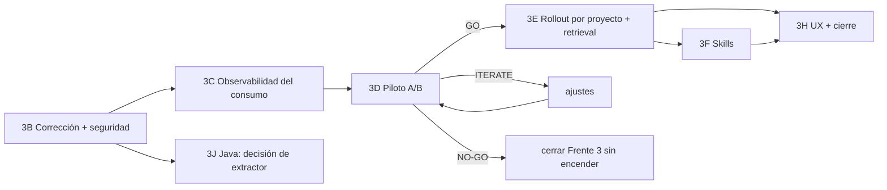

# Frente 3 / 3A — Roadmap propuesto (3B+)

Fecha: 2026-09-24 · Estado: **propuesta para aprobación.** Nada de esto está
iniciado.

La división sale de lo que ha encontrado el discovery, no de la lista del
brief. El orden importa por tres razones:

- **no se enciende nada** antes de corregir los defectos;
- **no se afirma ningún ahorro** antes de poder medir el consumo;
- **Skills no se integra** antes de cerrar los gaps de seguridad.

---

## 3B — Corrección y seguridad de lo existente — **IMPLEMENTADO (ver [3b-implementation.md](3b-implementation.md))**

**Objetivo:** que lo que ya existe sea correcto y seguro de encender. No se
añaden funcionalidades.

**Alcance:**

1. Cablear el Worker (y Repair con `RoleRepair`) al mismo decorador que el
   Planner y el Reviewer.
2. **Test de cableado:** con cada flag activo, cada superficie de dispatch de
   producción está decorada.
3. codegraph: indexar sólo ficheros rastreados (`git ls-files`); skip list
   unificada con la de memoria; guard de worktree en `Index`.
4. Memoria: denylist de secretos **antes de leer**, compartida con
   codegraph.
5. `incremental.go` y `drift.go` seguros frente a symlinks (el patrón de
   `codegraph.resolve`).
6. Redacción de excerpts persistidos.
7. Framing de datos en el pack y el router: eliminar "must follow" y
   delimitar el contenido.
8. Aplicar `AO_MEMORY_MAX_*`; estado `partial`.
9. Congelar `memory_mode`, `pack_digest` e `indexed_commit` en
   `policy_snapshot`.
10. `--end-of-options` en `git diff`, o retirar la fuente de grafo JSON del
    router.
11. Corregir los docs desactualizados (doc 02 §6).

**Riesgos:**
- Indexar sólo ficheros rastreados cambia qué se indexa en repos existentes
  (desaparecen ficheros untracked que hoy aparecen). Es intencionado, y habrá
  que comunicarlo.
- Tocar el launcher del worker, que ya tuvo una regresión.

**Criterios de aceptación:**
- Los 8 invariantes de doc 05 §3 cubiertos por tests.
- Test de cableado en verde.
- `go test` de los paquetes afectados (con `-race` y timeout ampliado según la
  memoria operativa).
- Lint delta limpio.
- `AO_MEMORY_MODE=off` sigue produciendo exactamente los mismos prompts que
  hoy (test de regresión de payload).

**Migraciones:** en principio **ninguna**. Si el estado `partial` necesita una
columna, sería 1 migración aditiva, validada sobre una copia de la DB real.

**Dependencias:** ninguna.

**Rollback:** revertir la rama. Todo sigue off por defecto. **Rebuild de
grafos contaminados en producción** (MEDUSA): es una operación aparte,
`ao memory graph sync`/rebuild, y **requiere aprobación explícita del
usuario**.

---

## 3C — Observabilidad del consumo

**Objetivo:** poder medir lo que el agente explora y consume, con y sin
memoria.

**Alcance:** los instrumentos I1-I6 de doc 06 §2:
- paths de lectura de tools (sólo paths);
- clase de turno para Codex y conteo de tool calls;
- split harness/AO estimado;
- `ObserveProviderUsage` conectado;
- índice de la primera edición.

**Riesgos:**
- Guardar paths es un dato nuevo, así que hace falta revisar su retención.
- Cambios en el formato de la transcripción de Claude o Codex. El parser ya es
  tolerante a esos cambios, y cualquier campo desconocido se ignora.

**Aceptación:**
- Sobre las fixtures de transcripción existentes, las métricas se derivan y
  coinciden con un conteo manual.
- Nada se reporta como medido si no lo está.

**Migraciones:** probablemente 1 aditiva (tabla de lecturas por llamada, o
columnas en `model_usage_events`). Validar sobre una copia real y revisar las
FKs entrantes (memoria operativa).

**Dependencias:** ninguna; puede ir en paralelo con 3B.

**Rollback:** los datos nuevos son aditivos y nadie depende de ellos.

---

## 3D — Piloto A/B

**Objetivo:** la decisión GO / ITERATE / NO-GO sobre encender memoria, con
evidencia.

**Alcance:** doc 06 §4-5: fixture, tareas A-D, brazos OFF/ASSISTED/PREFERRED y
N ≥ 5.

**Riesgos:**
- Coste en tokens: se estima antes.
- Varianza del proveedor.
- Host con memoria limitada: nunca junto a un AO vivo.

**Aceptación:**
- Informe con medianas y rangos.
- Los gates de calidad evaluados.
- Decisión explícita.

**Dependencias:** 3B y 3C.

**Rollback:** no aplica; el piloto no toca producción.

---

## 3E — Rollout por proyecto y mejoras de retrieval

*Sólo si 3D da GO.*

**Objetivo:** encender memoria **por proyecto** con el modo que haya
demostrado valor, y mejorar el retrieval donde 3D haya mostrado problemas.

**Alcance:**
- Mover el flag de memoria de env global a una opción por proyecto.
- Reviewer: diff + vecindario afectado (conectar `AnalyzeChanged`).
- FTS5 y resolución de aristas `call`, sólo si 3D mostró un problema de
  precisión.
- Retirar el `contextrouter` como ensamblador duplicado.

**Riesgos:**
- Un proyecto sin medir no se enciende.
- Cambiar el default global está fuera de alcance salvo decisión expresa.

**Aceptación:**
- Por cada proyecto que se encienda, su propio antes/después con el ledger.

**Rollback:** apagar el modo del proyecto.

---

## 3F — Integración con Skills

*Después de 3B; si hay demanda.*

**Alcance:**
- Capability `memory.read`.
- Filtro por `FileScope`.
- Entrega como fichero staged.
- Vinculación al commit (doc 04 §8).

**Aceptación:**
- Invariante 7 (doc 05 §3).
- Un E2E con `authz-review` con y sin memoria, y el informe de hallazgos
  comparado.

**Riesgos:**
- Debilitar los controles del Frente 2. Mitigación: un Skill sin la
  capability no recibe nada, y hay test.

**Rollback:** revocar la capability.

---

## 3J — Cobertura Java

*Paralelo; decisión antes de construir.*

**Objetivo:** decidir entre extractor propio y adaptador externo (doc 06 §6).

**Alcance:**
- Prototipo read-only del extractor sobre una copia staged de
  `ws_sigeseguros_crm`.
- Medición de cobertura.

**Aceptación:**
- Decisión escrita con números, que actualiza el ADR 0012 (Q1).

**Riesgos:** ninguno en producción.

---

## 3H — UX y cierre

**Alcance:**
- Freshness y cobertura por lenguaje.
- "What did the agent get?" por run.
- "Why" para símbolos.
- Tarjeta de impacto medido.
- Informe de cierre.

(doc 04 §11)

---

## 4. Deuda existente: fuera del Frente 3 (ETAPA 19)

Se registra sólo cuando interactúa con el diseño:

| Deuda | Interacción con el Frente 3 |
|---|---|
| **Frente 4: aislamiento de `HOME` y recorte de tools/MCP para worker/reviewer** | **Alta.** Probablemente ahorra más que la memoria (el 92 % de la 1.ª llamada es del harness). El piloto aísla `HOME` en todos los brazos para no confundir los efectos. Recomendación: priorizarlo en el Frente 4 en paralelo |
| P2/P3 de Skills (tests de up/down de 0161/0162/0166/0169, CLI cancel, UI de revocación de pentest) | Ninguna, salvo que 3F toque la capability table. No se mezcla |
| D2 limpieza de fixtures en la DB productiva | Ninguna. Nota: esas fixtures tienen grafos indexados (`ao-pilot`, `ao-canary-*`), así que desaparecerán con la limpieza |
| Deuda de integración con `main` | Ninguna directa. 3B+ se integra en ECC como hasta ahora |
| Windows/ConPTY, remote runners, marketplace, Security Intelligence | Ninguna |

---

## 5. Preguntas abiertas para el usuario

1. **¿Qué es "Grae"?** No se ha podido identificar ningún proyecto. ¿Error de
   transcripción de otra herramienta (GraphRAG, Graphiti…), o hay que
   descartarlo?
2. **Umbrales del piloto** (−15 % input sin caché, −20 % llamadas o
   exploración): ¿aprobados o hay que ajustarlos antes de 3D?
3. **Rebuild del grafo de MEDUSA** en producción, para purgar el 24,7 % de
   símbolos de un worktree: ¿se autoriza tras 3B, o antes con
   `ao memory graph sync` manual?
4. **¿Hay demanda real de agentes sobre SIGE o ws_sigeseguros_crm (Java)?**
   Condiciona la prioridad de 3J.
5. **¿Se prioriza en paralelo el subalcance del Frente 4** (aislamiento del
   contexto del harness)?
